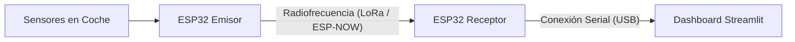

# 🏎️ PowerWheels Telemetry & Sector Timer

[](https://www.python.org/)
[](https://streamlit.io/)
[](https://www.espressif.com/)

Un sistema completo de telemetría en tiempo real y cronometraje por sectores para vehículos **PowerWheels** (coches eléctricos infantiles modificados para carreras), configurado específicamente para el trazado real del **Circuito PTC Escuela en A Pastoriza (Lugo, Galicia, España)**.

---

## 🗺️ Trazado Real: Circuito de A Pastoriza

El sistema utiliza coordenadas geográficas reales extraídas de OpenStreetMap para posicionar el vehículo con precisión matemática a lo largo de la pista de **1,200 metros**:
- **Meta (Línea de Salida/Llegada)**: `(43.2968702, -7.3384242)`
- **Sector 1**: `(43.2965345, -7.339701)`
- **Sector 2**: `(43.2964173, -7.3388131)`

---

## ⚡ Características Principales

- **🗺️ Renderizado de Mapa Interactivo**: Vista 3D en perspectiva del circuito impulsada por `Pydeck` (deck.gl) sobre estilos oscuros de Mapbox.
- **🎨 Generación Automática del Circuito**: Dibuja en tiempo real un circuito detallado (`circuit_ptc.png`) con asfalto, bordillos de seguridad (pianos) de color rojo y blanco, y una línea de salida/llegada ajedrezada (damero) ajustada milimétricamente al trazado real.
- **⏱️ Cronómetro Inteligente por Sectores**: Detecta de forma autónoma el paso del vehículo por cada sector utilizando un sensor de distancia GPS virtualizado y actualiza el **Último Tiempo** y el **Top 3 de Mejores Tiempos** históricos por sector.
- **📊 Telemetría Avanzada**:
  - Velocidad lineal simulada en tiempo real.
  - Temperatura del motor y bloque térmico.
  - Tacómetro dinámico con barras de estado de color interactivo.
  - Historial de ruta (trazada azul sobre el circuito).

---

## 📂 Estructura del Repositorio

```text
PowerWheels/
├── app.py              # Aplicación Web de Telemetría (Streamlit + Pydeck)
├── Emisor/
│   └── Emisor.ino      # Código C++ (Arduino) para el ESP32 emisor a bordo del coche
├── Receptor/
│   └── Receptor.ino    # Código C++ (Arduino) para el ESP32 receptor conectado a la base
└── venv/               # Entorno virtual de Python con las dependencias instaladas
```

---

## 🚀 Guía de Inicio Rápido

### Requisitos Previos

Asegúrate de tener instalado Python 3.10 o superior.

### 1. Activar el Entorno Virtual

Abre tu terminal en la carpeta del proyecto y ejecuta:

```bash
# En Linux / macOS:
source venv/bin/activate

# En Windows (CMD):
venv\Scripts\activate.bat

# En Windows (PowerShell):
venv\Scripts\Activate.ps1
```

### 2. Iniciar el Servidor de Telemetría

Ejecuta el siguiente comando con el entorno virtual activado:

```bash
streamlit run app.py
```

El navegador se abrirá automáticamente en `http://localhost:8501`.

---

## 🛠️ Arquitectura de Telemetría Física



1. **Emisor (`Emisor.ino`)**: Lee las revoluciones por minuto (RPM) del motor y los sensores de temperatura analógicos/digitales y los emite de manera inalámbrica.
2. **Receptor (`Receptor.ino`)**: Recibe la señal del coche y la inyecta al ordenador a través del puerto serie.
3. **Dashboard (`app.py`)**: Visualiza la telemetría, mapea la ubicación del GPS sobre el circuito de A Pastoriza y calcula los tiempos de vuelta.
